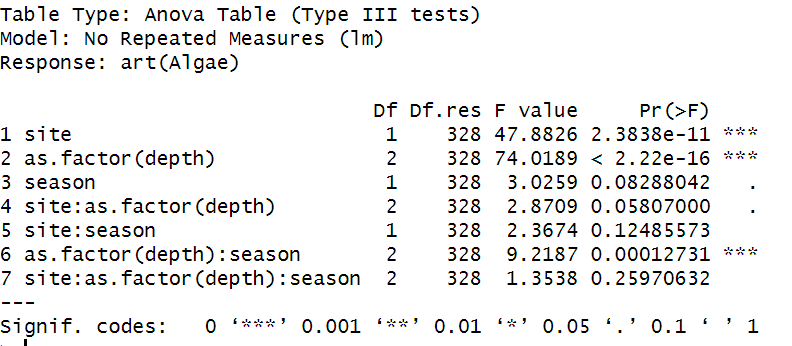

# **Data Analysis**

## **Data from the Photo-Survey of Benthic Biota across Two Transects of the Eastern Mediterranean Continental Shelf**

I began by loading and examining the contents of the two provided CSV files. This step was crucial for understanding the data structure and planning the subsequent analysis. The metadata file contains details about each transect, including site, depth, season, and transect ID, while the processed data file includes percentage coverage values for different taxonomic groups in each transect.

## **Steps Taken:**

 ### **1.	Selection of taxonomic group:** 
 I chose algae for analysis.
 ### **2.	Analysis of algae coverage:**
 Respect to site, season, and seafloor depth.  
 Interaction with other taxonomic groups.

 ## **Starting with the first step, that is, analyzing algae coverage with respect to the three main variables.**

 1.	I merged the metadata and processed data on the transect ID.
 2.	I performed descriptive statistics and visualized the data (figure 1).
 3.	I conducted statistical tests to analyze the effects of site, season, and seafloor depth on algae coverage.

 ## **The descriptive statistics for algae coverage are as follows:**

 Count=340 samples, mean =43.27%, standard deviation=24.19%, minimum=0.48%, 25th percentile=21.80%, 50th percentile=45.85%, 75th percentile=62.50%, and maximum=92.79%.

 ## **ART ANOVA reveals significant effects of site and depth on algae coverage**

 Next, I performed statistical tests to determine if the 3 variables have significant effects on algae coverage as shown in figure 2. I used ART ANOVA since the data have multiple groups for each variable and not normally distributed. The ART ANOVA test indicated that algae coverage varies significantly with site and seafloor depth, but not with season.

 
Figure 1: Boxplots showing how algae coverage varies by site, season, and seafloor depth

  
Figure 2: ANOVA results showing the effects of site, season, and seafloor depth on algae coverage

## **There was no significant difference in algae coverage between the two samplers**

To check for differences in algae coverage between the two samplers, I conducted an additional test. The results showed no significant difference (*P-value* = 0.408) between the two samplers (figure 3).

  
Figure 3: Boxplot of algae coverage between the two samplers

## **Exploring Algae-Bryozoa interaction using Log-transformed data and Benjamini-Hochberg correction**

I examined the interaction between algae coverage and another taxonomic group, Bryozoa. 

The choice for examining the correlation between algae and bryozoa from the data obtained in the benthic biota survey is due to its ability to reveal key ecological interactions and dynamics within the ecosystem. Understanding this relationship can highlight competitive interactions, as algae and bryozoa often compete for space, light, and nutrients, which can affect community structure and biodiversity. Additionally, bryozoans provide complex habitats that can influence algal colonization and growth. The presence and abundance of both groups can also serve as indicators of environmental conditions, such as changes in water quality, pollution, or climate change impacts.

The correlation between algae and bryozoa was visualized using a scatter plot (figure 4). I transformed the square matrix to a log format and adjusted the *P-value* using the Benjamini-Hochberg (BH) method. I downloaded an output file name “Taxonomic_groups_spearman”.

.png>)  
Figure 4: Spearman correlation between algae and Bryozoa

## **Conclusion**

The Spearman correlation analysis revealed a strong and statistically significant negative correlation between algae and Bryozoa coverage (r=−0.742, *P-value*=0). This finding suggests that Bryozoa coverage tends to decrease significantly as algae coverage increases. This negative interaction could be due to competition for resources such as space, light, or nutrients, or differing habitat preferences. Understanding this relationship is crucial for ecological studies, environmental monitoring, and resource management, as it provides insights into the dynamics of the benthic community and helps in developing effective conservation strategies.

