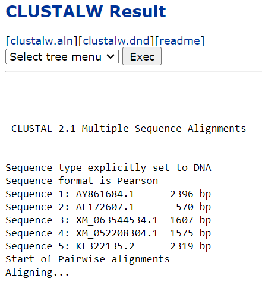
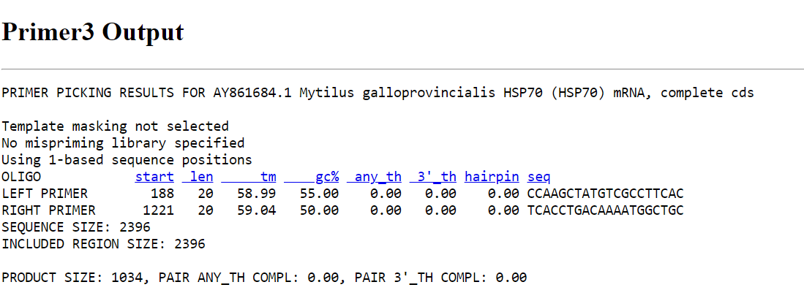

# **Designing qPCR primers to test for heat shock proteins (HSP) 70 in *Brachidontes pharaonis* in the presence of heat stress**

# **Designing the primers (forward and reverse) to detect HSP70 in *B. pharaonis***

I could not identify the particular sequence that codes for HSP70 in *B. pharaonis* because its whole genome has not been sequenced yet. To obtain sequences that may code for this gene, I visited the website of the [National Center for Biotechnology Information (NCBI)](https://www.ncbi.nlm.nih.gov/) and searched for *Mytilus* HSP70 in the database. I selected and downloaded the FASTA sequences of five *Mytilus* species, as they belong to the same family as *B. pharaonis*: *Mytilus galloprovincialis* HSP70 mRNA, *Mytilus edulis* HSP70 mRNA, *Mytilus trossulus* HSP70 mRNA, *Mytilus californianus* HSP70 mRNA, and *Mytilus coruscus* HSP70 mRNA.

## **Alignment of Sequences**

I then aligned the five downloaded sequences using  [CLUSTALW](https://www.genome.jp/tools-bin/clustalw). This helped me identify the conserved and variable regions of the sequences. I proceeded with the conserved regions for the primer design.

   
Figure 1: Multiple sequence alignment of the *Mytilus* species

## **Picking of Primers**

I visited the [Primer3](https://primer3.ut.ee/) website for the primer design. I pasted the conserved sequence and set the primer size range to 1000-1500 base pairs, then clicked on "Pick Primers."

  
Figure 2: Primer designed for HSP70 detection

# **Reason for selecting HSP70 as my gene of interest**

*B. pharaonis* has several defense mechanisms to survive or resist stress, which can be physical, behavioral, or molecular. At the molecular level, HSPs upregulation is a crucial defense mechanism that protects biomolecules from thermal and oxidative stress.

HSP70, in particular, plays a significant role in protein folding, protein transport, and maintaining cellular homeostasis. The induction of HSP70 is a reliable indicator of molecular defense against various stressors, including antibiotics, microplastics, pollution, xenobiotics, and elevated temperatures. Without the induction of HSPs like HSP70, oxidative damage occurs, compromising cell function.

Given its critical functions in stress response and cellular protection, assessing HSP70 induction and concentration provides valuable insights into the organism’s molecular defense mechanisms and exposure to stress.

# **Expected Changes in HSP70 Expression Levels**

I expect that exposure to thermal stress will lead to a significant increase in the expression levels of HSP70 in *B. pharaonis*. Thermal stress is known to induce the production of HSPs, including HSP70, as part of the organism's molecular defense mechanism. Specifically, I anticipate the following changes:

1. **Upregulation of HSP70**: The elevated temperatures will likely cause a substantial upregulation of HSP70 expression. This is because HSP70 plays a critical role in protecting cells from the damaging effects of heat by ensuring proper protein folding and preventing protein aggregation.

2. **Temporal Expression Patterns**: The increase in HSP70 expression may exhibit a temporal pattern, with peak levels occurring shortly after the onset of thermal stress. Over time, as the mussels either adapt to the new temperature or succumb to stress, the expression levels may stabilize or decrease.

3. **Magnitude of Expression Change**: The magnitude of the increase in HSP70 expression will depend on the severity and duration of the thermal stress. More intense and prolonged heat exposure is expected to result in higher levels of HSP70 induction.

Overall, the induction of HSP70 in response to thermal stress will serve as a marker of the organism's stress response, reflecting its efforts to maintain cellular homeostasis and protect against thermal damage.

# **Stress/Conditions for Testing HSP70 Expression**

I plan to test HSP70 expression levels in *B. pharaonis* under the following stress conditions:

1. **Thermal Stress**: The primary condition to be tested is thermal stress, involving exposure to elevated temperatures. This will simulate the effects of rising sea temperatures on mussels in a microcosm scale.

2. **Pollution and Contaminants**: I will test the mussels against environmental pollutants such as heavy metals and oil pollution. These pollutants are known to induce stress responses, including the upregulation of HSPs.

5. **Combined Stressors**: Finally, I will investigate the effects of combined stressors, such as simultaneous exposure to thermal stress and pollutants, to study the cumulative impact on HSP70 expression and the overall stress response in mussels.

By testing HSP70 expression under these various conditions, I aim to gain comprehensive insights into the molecular defense mechanisms of *B. pharaonis* and how different stressors impact their ability to cope with environmental changes.

# **Choice of Reference Genes**

To ensure accurate and reliable quantification of HSP70 expression levels, it is crucial to select appropriate reference genes for normalization in qPCR analysis. The reference genes should be stably expressed across all experimental conditions. For *Brachidontes pharaonis*, I will consider the following reference genes as validated in the work of [Martinez-Escauriza et al., 2018](https://sci-hub.se/10.2983/035.037.0108).

1. **Glyceraldehyde-3-phosphate dehydrogenase (GAPDH):** The authors of the paper recommended using GAPDH as a suitable reference gene for mussel studies, specifically in *M. galloprovincialis* which is of the family as *B. pharaonis*.

2. **40S ribosomal protein S4 (rps4):** rps4 demonstrated to have stable expression across different stress conditions in mussels.

3. **Cytochrome c oxidase subunit 1 (cox1):** This gene also demonstrated a stable expression and particularly for normalization in the digestive gland and gill tissues.

4. **In the mantle tissue:** The most suitable combination of reference genes for normalization was GAPDH, rps4, and 40S ribosomal protein S27.

  
Figure 3: Multiple sequence alignments and primer design of sequences for the reference gene, GAPDH. 

Before finalizing the reference genes, I will perform a preliminary validation to ensure their stability under the specific experimental conditions of my study. This validation will involve assessing the expression stability of these candidate reference genes across all samples and conditions.

By carefully selecting and validating stable reference genes, I will ensure accurate normalization of HSP70 expression levels, leading to reliable and meaningful results.

