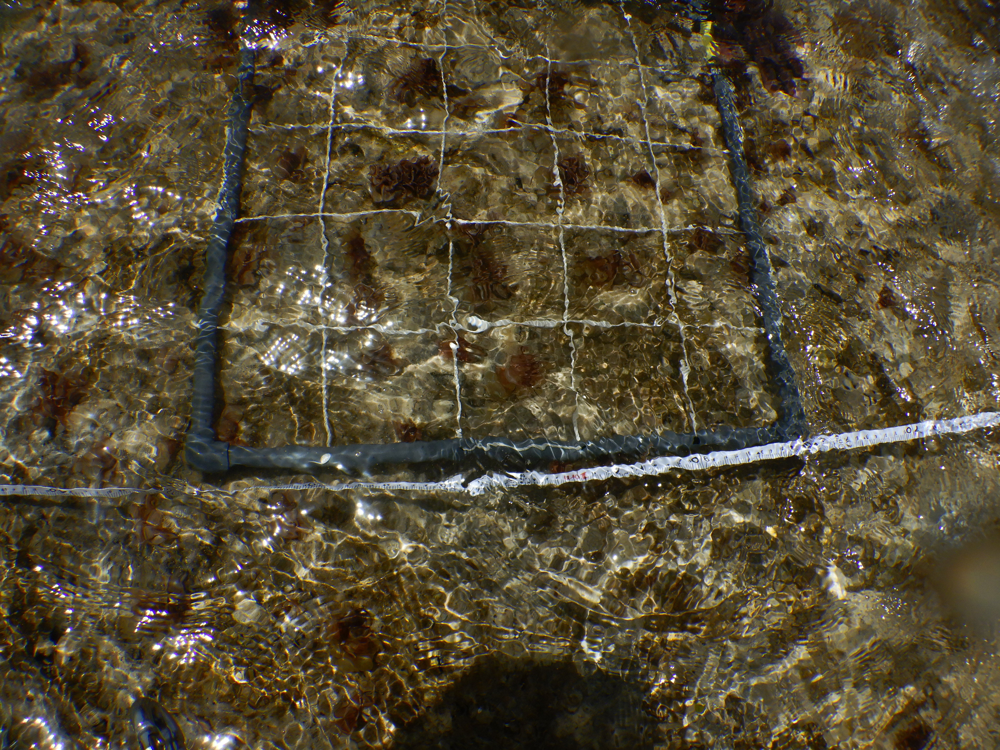

# **Hands-On Learning: Marine Research Methods at the Morris Kahn Marine Research Station (MKMRS)**

## **Arrival and Preparation Talk at the Morris Kahn Marine Research Station**

We undertook this field trip to the MKMRS as part of the research methods course led by Professor Tali Mass and Dr. Tal Luzzatto Knaan on the 23rd of May 2024. The participants of the course arrived either individually or in groups. Upon arrival, snorkeling gear was provided to those who did not have their own. We then proceeded to the sea where we received an explanation of the activities planned for the day (Figure 1), which included identifying various marine intertidal organisms, mainly algae, snorkeling to depths of about 2 meters and above (optional), and how to collect marine samples.

 
 Figure 1: Receiving overview of the field trip activities.

 ## **Identification of Marine Intertidal Organisms and Counting of Algae**

 The sea was calm that day, and walking on the intertidal shore was an exciting experience that facilitated the identification of intertidal organisms, primarily algae. We also observed some crabs and limpets. We were provided with a list of algae species along with photographs to aid in accurate identification. The dominant species of algae we found included *Padina*, *Ulva*, and *Jania*.
We gained hands-on experience in quantifying the coverage of algae within a specified area. We used transects and quadrats for this task. We laid a 25-meter transect line and placed quadrats every 5 meters to count the number of algae present within each location (Figure 2). We laid two transect lines and counted the algae present; the results are shown in Tables 1A and 1B.

Figure 2: Counting Algae within a specified area by placing quadrants.

Table 1: Algae coverage counts along two transect lines on the intertidal shore

## **A**
| Distance (m) | Padina | Jania | Sargassum |
| ------------ | ------ | ----- | --------- |
| 5            | 0      | 33    | 6         |
| 10           | 8      | 0     | 0         |
| 15           | 15     | 25    | 0         |
| 20           | 15     | 15    | 0         |
| 25           | 0      | 25    | 0         |

## **B**
| Distance (m) | Padina | Jania | Laurencia |
| ------------ | ------ | ----- | --------- |
| 5            | 14     | 16    | 9         |
| 10           | 12     | 24    | 0         |
| 15           | 23     | 6     | 0         |
| 20           | 20     | 17    | 0         |
| 25           | 0      | 14    | 0         |

## **Measurement of Sea Surface and Seawater Temperatures**

We monitored both the sea surface temperature (SST) and seawater temperature (SWT) using two HOBOconnect devices. One device was placed on the intertidal zone to record the SST, while the other was placed about 2 meters into the sea to record the SWT from 10 AM IDT. The temperatures recorded by the loggers are shown in Figure 3.

       

Figure 3: Recorded Sea Surface and Seawater Temperatures Using HOBOconnect devices

## **Collection and Testing of the Induction and Quenching of Chlorophyll Fluorescence of *Padina* Using Pulse Amplitude Modulated (PAM) Fluorometry**

Two samples of the algae *Padina* (Figure 4) were collected from high-light (more exposed to sunlight) and low-light (less exposed to sunlight, in the shade) environments and transported to the lab for physiological studies. The simplest and fastest method we could conduct was to study the induction and quenching of chlorophyll fluorescence in the *Padina* samples using a PAM fluorometer as a proxy for photosynthesis.
The samples were kept in the dark for about an hour. During the PAM fluorometry, they were exposed to light intensities ranging from 200 to 600 µmol photons/m²/s. Specific sections of the samples were marked to measure their photosynthetic electron transport rate (ETR), as shown in Figures 5A and 5B.

Figure 4: Collected *Padina* samples from low and high light environments

## **A**

Figure 5A: Sections targetted to measure photosynthetic electron transport rate of *Padina* samples 

## **B**

Figure 5B: Photosynthetic electron transport rates of sections targetted on the *Padina* samples from from both low and high Llight environments